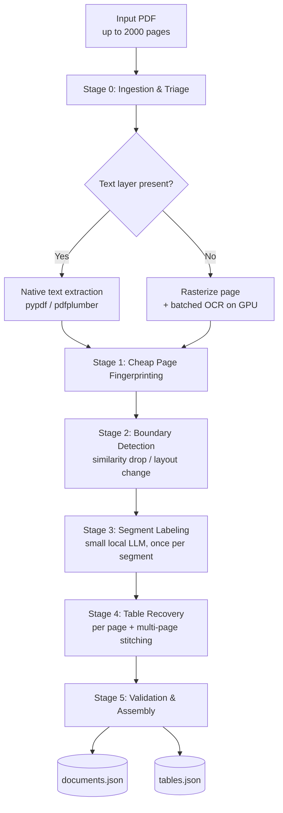

# PRD: Logical Pagination & Table Structure Recovery for the 2,000-Page Loan File

**Problem Statement B — "Structuring the 2,000-Page File: Tables & Logical Pagination"**
**Owner:** Rishabh Soraganvi | **Track:** Systems / ML | **Status:** Draft v1
**Target deployment:** Vultr Cloud GPU — NVIDIA A16 (single-GPU slice, 16GB VRAM)

---

## 1. Problem Recap

A loan file arrives as a single PDF (up to ~2,000 pages) containing dozens of distinct
documents scanned/merged with no table of contents and no boundary markers. Two
foundational problems block everything downstream:

1. **Logical pagination** — recover the *exact page span* of every individual document
   instance (type, start page, end page, distinguishing attribute), even when several
   instances of the same type sit back-to-back (e.g. 3 years of Form 1040, 12 months of
   bank statements, 10+ biweekly paystubs).
2. **Table structure recovery** — turn tables embedded in those pages (often spanning
   multiple pages, with repeating headers, interrupting subtotal rows, and drifting
   columns) into structured, machine-usable data.

**Explicit constraint:** efficiency is graded, not just correctness. The brief asks for
open-source/smaller models, modest token and compute budgets, and a credible story for
running at 2,000-page scale — not just on a 10-page demo.

---

## 2. Sample File Analysis (`doc_000.pdf`, 161 pages)

Before designing anything, I profiled the provided sample to ground the design in real
structure rather than assumptions.

| Finding | Detail |
|---|---|
| Page rendering is **mixed** | `pdftotext` returns empty on most pages (pages 1–19, 30, 40, 50, 60, 70…) — these are full-page rasterized scans (JPEG, 1275×1650, ~150 DPI) with **no text layer**. Pages 80, 100, 110+ **do** carry a native text layer. The same document *type* (Chase statements) appears in both forms across the file. |
| Document boundaries are **not 1:1 with page breaks** | A single Chase checking statement runs **17–20 pages** (page 3 → 19), and the file contains **4–5 consecutive monthly statements** for the same account (pages ~3–84) before the next document type appears. |
| Repeated-type runs are common | 10+ biweekly "Smith, Lewis and Chambers" paystubs appear consecutively near the end of the file — directly matching the spec's "multiple paystubs" example. |
| Multi-page tables repeat headers, not totals | Each continuation page of a bank statement re-prints the `DATE / DESCRIPTION / WITHDRAWALS / DEPOSITS / BALANCE` header, but the `Totals` row at the bottom is **identical on every page** — it's the **broadcast period-end total**, not a per-page subtotal. Naively summing per-page "Totals" rows would massively over-count. |
| Branding ≠ ground truth | A Chase-branded statement's footer disclosure text reads *"PNC Bank – Member FDIC…"* — a mismatch between header letterhead and footer boilerplate. Footer text is **not reliable** for lender/bank classification. |
| Near-blank pages exist | Some statements end with a page that is >95% white space carrying only a one-line disclosure — these must still be attributed to the preceding document, not treated as a new boundary or a low-confidence page needing heavy OCR. |
| Document taxonomy is wide | Across the sample: Loan Summary Dashboard, Schedule C, Chase bank statements (×5), W-2, Email Correspondence Record, Closing Disclosure, Purchase & Sale Agreement + Addendum, Form 1008 (Fannie Mae UW Transmittal Summary), WVOE, Loan Estimate, Closing Cost Details, Letters of Explanation (×2–3, distinguished by subject), URLA/1003, Verification of Deposit, Security Deed (dense legal text + signature pages), Consumer Account Terms, DU Underwriting Findings, Earnings Statements (×10+). |

These observations directly shape the design choices in Section 4.

---

## 3. Goals & Non-Goals

**Goals**
- Given any PDF up to ~2,000 pages, output a clean list of document instances with
  `{doc_id, doc_type, start_page, end_page, distinguishing_attribute, confidence}`.
- Recover every table (including ones spanning multiple pages) as structured rows tied
  to its parent document instance.
- Keep the *expensive* model (LLM/VLM) off the hot path for the vast majority of pages.
- Be explicit about cost/latency at 2,000-page scale, not just correctness on a sample.

**Non-Goals (for this problem statement)**
- Income reconciliation, question-answering, or file triage — those are the other three
  problems in the hackathon and consume this system's output as input.
- Perfect OCR of degraded scans — we aim for "good enough for structured extraction,"
  with confidence scores surfaced rather than silently guessing.

---

## 4. System Architecture



The core idea: **spend compute proportional to uncertainty, not to page count.**
Cheap, deterministic signals do the bulk of the work; the LLM is reserved for the small
number of genuinely ambiguous decisions (boundary confirmation, type labeling at the
segment level — once per document instance, not once per page).

---

## 5. Pipeline Stages

### Stage 0 — Ingestion & Triage
- Split the PDF into pages; for each, check for a text layer (`pypdf` char count
  threshold, mirroring what `pdffonts`/`pdftotext` showed on the sample).
- Native-text pages → direct extraction (near-zero cost).
- Scanned pages → queued for **batched** OCR on GPU (PaddleOCR or EasyOCR — open
  source, runs locally, satisfies the data-confidentiality requirement). This split is
  the same GPU/CPU service separation already proven in SENTINEL v2-HX's Docker
  Compose setup.

### Stage 1 — Cheap Per-Page Fingerprinting (no LLM)
For every page, compute a lightweight feature vector with classical tools only:
- Header/footer text (top 15% / bottom 15% of page).
- Layout fingerprint: line/grid density, column count, whitespace ratio (OpenCV).
- A small local sentence-embedding of normalized header text (for similarity scoring).

This is what makes the pipeline cheap: boundary detection runs on ~50-dimensional
vectors, not on raw page images or LLM calls.

### Stage 2 — Logical Pagination (Boundary Detection)
Framed as **change-point detection over a page sequence**, not independent per-page
classification:
1. Compute page-to-page similarity (header fingerprint + layout vector). A sharp drop
   is a *candidate* boundary.
2. Candidate boundaries are cheap to over-generate and expensive to under-generate, so
   the threshold is tuned permissive — false positives get merged back in Stage 3.
3. **Same-type run splitting** (the Form 1040 / bank-statement / paystub case): within a
   run of visually-identical headers, extract a distinguishing attribute — statement
   period, tax year, pay-period date range, account number — from each segment's first
   page and split on attribute change. This directly targets the "three Form 1040s"
   example and the 10+ paystub run observed in the sample.
4. Near-blank trailer pages (low ink density, no new letterhead) are folded into the
   preceding document rather than treated as boundaries.

### Stage 3 — Segment Labeling (the only place an LLM is called)
For each *segment* produced by Stage 2 (not each page):
- A small local model (e.g. Llama-3.2-3B-Instruct or Qwen2.5-3B, GGUF/Ollama,
  text-only) reads the header/footer text already extracted in Stage 1 and assigns
  `doc_type` + `distinguishing_attribute`, and confirms/rejects the candidate boundary.
- A VLM call (e.g. a 2B–7B quantized Qwen2-VL) is escalated to **only** if the text
  signal is insufficient — e.g. a scanned page with low-confidence OCR.
- This collapses LLM calls from "one per page" (2,000) to "one per document instance"
  (≈100–150 on a file like the sample), each on a few hundred tokens of header text
  rather than a full page image.

### Stage 4 — Table Structure Recovery
- **Native-text pages:** `pdfplumber`/Camelot table extraction — deterministic, cheap.
- **Scanned pages:** open-source table-structure model (e.g. Microsoft's Table
  Transformer) to locate the table region, then OCR tokens are clustered into rows/
  columns by coordinate.
- **Multi-page stitching:** for a table on page *N*, fingerprint its header row. If page
  *N+1* (within the same document instance) opens with a matching header fingerprint,
  treat it as a continuation: drop the duplicate header, append rows to the same logical
  table object.
- **Totals handling (informed directly by the sample):** a footer row matching
  `Totals`/bold-numeric pattern is flagged as a *broadcast statement total*, not summed
  across pages. The system uses the **last page's totals row** as the document-level
  total and cross-checks it against the sum of extracted transaction rows as a
  data-quality assertion, rather than blindly accumulating per-page subtotals.
- Each recovered table is emitted with a normalized schema per known doc type (e.g.
  `bank_statement_transaction{date, description, withdrawal, deposit, balance}`).

### Stage 5 — Validation & Assembly
- Cross-check: segment page spans must be contiguous and non-overlapping and must sum
  to the total page count.
- Cross-check: extracted totals reconcile against summed row data (flag, don't fail,
  on mismatch — surfaced as a confidence flag for the downstream reconciliation
  problem).
- Emit `documents.json` and `tables.json`.

---

## 6. Output Schema

```json
// documents.json
[
  {
    "doc_id": "doc_0007",
    "doc_type": "bank_statement_chase_checking",
    "start_page": 3,
    "end_page": 19,
    "distinguishing_attribute": {
      "statement_period_start": "2023-06-08",
      "statement_period_end": "2023-07-07",
      "account_number_last4": "1372"
    },
    "confidence": 0.97,
    "source": "ocr"        // "native_text" | "ocr" | "mixed"
  }
]
```

```json
// tables.json
[
  {
    "doc_id": "doc_0007",
    "table_id": "doc_0007_t1",
    "schema": "bank_statement_transaction",
    "page_span": [3, 19],
    "rows": [
      {"date": "2023-06-08", "description": "DEBIT CARD PURCHASE, AMAZON 762",
       "withdrawal": 1012.01, "deposit": null, "balance": 49481.04}
    ],
    "reported_total": {"withdrawals": 414315.83, "deposits": 517401.38, "ending_balance": 153578.60},
    "computed_total": {"withdrawals": 414315.83, "deposits": 517401.38},
    "reconciled": true
  }
]
```

---

## 7. Model & Tooling Choices (efficiency-first)

| Need | Choice | Why |
|---|---|---|
| OCR | PaddleOCR / EasyOCR | Open source, local, GPU-batchable, no per-page API cost, keeps borrower PII off third-party endpoints. |
| Native table extraction | pdfplumber / Camelot | Deterministic, CPU-only, no model needed when a text layer exists. |
| Scanned table structure | Table Transformer (TATR) | Open-source, small, purpose-built for table region + cell structure; comfortably fits an A16 slice. |
| Segment labeling | Llama-3.2-3B / Qwen2.5-3B via Ollama (GGUF, quantized) | Text-only calls are cheap; runs locally for confidentiality; fits in a few GB of VRAM with headroom to spare on a 16GB A16 slice. |
| Escalation VLM (rare) | Qwen2-VL-7B (4-bit quantized) | A16's 16GB/slice (vs. the 4GB Quadro T1000 used for local dev) comfortably fits a 7B-class VLM instead of forcing a 2B model — only invoked for low-confidence scanned segments. |
| Orchestration | FastAPI service, Docker Compose | GPU-bound services (OCR, TATR, LLM/VLM) split from CPU-bound services (fingerprinting, stitching, validation), mirroring the SENTINEL v2-HX container split. |
| Production/demo target | Vultr Cloud GPU — **NVIDIA A16** | Ampere architecture, 16GB VRAM and ~200GB/s bandwidth per GPU slice, PCIe (no NVLink). Vultr sells it as a single board carrying 4 such slices (64GB combined, not pooled). It's purpose-built for VDI + lightweight inference rather than training — which matches this pipeline's profile exactly. |

**Why A16 specifically fits this design:** the architecture in Section 4 was already built
around "many small, cheap inference calls" rather than one big training/fine-tuning job.
A16's lower FP32/TF32 throughput relative to an A40 or A100 (it's a VDI-class card, not a
training card) is a non-issue here because nothing in the pipeline trains — it only runs
batched OCR inference, table-structure inference, and short text-only LLM calls. The
4-slices-per-board layout also maps cleanly onto the GPU/CPU service split: one slice can
be dedicated to the OCR batch queue and another to the TATR/LLM segment-labeling queue,
without the two contending for the same memory pool. No NVLink means no multi-GPU model
sharding — but every model in this stack is deliberately kept small enough (≤7B,
quantized) to need only a single slice anyway.

---

## 8. Efficiency Strategy & Cost Model

The brief specifically asks: *what does this cost at 2,000-page scale?* Brute force —
running a large hosted VLM over every page — does not scale; this design avoids that
by construction, and the target hardware (Vultr A16) reinforces that choice rather than
fighting it.

**A16 profile (single GPU slice, as rented on Vultr):** 16GB VRAM, ~200GB/s memory
bandwidth, PCIe (no NVLink), on-demand pricing around **$0.48–0.56/GPU-hour**. It's an
Ampere-generation, inference/VDI-optimized card — noticeably lower FP32/TF32 throughput
than an A40 or A100, and not intended for training. That's fine here: every model in the
stack (OCR, TATR, the 3B segment labeler, the escalation VLM) only ever does inference.

| Approach | LLM/VLM calls on a 2,000-page file | Typical input per call | Where compute goes |
|---|---|---|---|
| **Brute force** (large hosted VLM on every page) | ~2,000 | Full-page image (~1,500–2,500 tokens) | All cost is hosted-API inference; linear in page count regardless of redundancy; would also exceed what a single A16 slice can serve at that model size. |
| **This design (hybrid, on one A16 slice)** | ~100–150 (one per document *instance*, escalation only on low-confidence scans) | Header/footer text snippet (~200–400 tokens) | Bulk of pages are handled by OCR (GPU-batched on the A16) + classical CV/table libraries (CPU, near-instant). The 3B labeler and 7B escalation VLM both run comfortably within the 16GB slice. |

Estimated rough order of magnitude for a 2,000-page file with a scan/native mix similar
to the sample (≈70% scanned):
- Triage (text-layer check): seconds, CPU only.
- Batched OCR (~1,400 scanned pages) on one A16 slice: on the order of minutes, not
  hours — A16's lower compute ceiling than an A40/A100 is not a bottleneck for OCR-scale
  batch inference.
- Boundary/fingerprinting: CPU, seconds, since it operates on small feature vectors.
- LLM segment labeling: ~150 short text-only calls to the local 3B model, plus a handful
  of escalations to the 7B VLM for low-confidence scans — all on the same A16 slice, no
  external API spend.
- **Indicative compute cost:** at ~$0.50/GPU-hour, even a generous 1–2 hour end-to-end
  A16 run for the full 2,000-page file lands around **$0.50–$1.00 in GPU time** — the
  real comparison point for the write-up against a brute-force hosted-VLM pass over every
  page.

These are planning-stage estimates to be replaced with measured numbers from the
prototype once deployed on the actual A16 instance; the write-up will report measured
wall-clock time, GPU-hours, and (if any) token spend on the full sample file, plus a
projection to 2,000 pages.

---

## 9. Edge Cases (grounded in the sample file)

- **Mixed scanned + native pages within the same recurring doc type** — the boundary
  detector and table extractor must both support either input mode per page, not assume
  uniformity within a document type.
- **Identical "Totals" rows repeated on every continuation page** — must not be summed;
  treat as the broadcast period total and validate, don't accumulate.
- **Footer boilerplate naming a different institution than the header letterhead** — never
  trust footer text alone for type/issuer classification.
- **Long runs of the same document type** (12 statements, 10+ paystubs, multiple LOEs) —
  must split purely on a distinguishing attribute extracted from segment content, since
  visual layout is identical across instances.
- **Near-blank trailer/disclosure-only pages** — fold into the preceding segment; don't
  let a low-text-density page trigger a false boundary or a wasted OCR/LLM call.
- **Multi-page legal instruments with no tables** (e.g. the Security Deed) — boundary
  detection must work even when there is no table to anchor on, relying purely on
  header/layout/text fingerprinting.

---

## 10. Evaluation Plan

| Metric | What it measures |
|---|---|
| Boundary F1 (page-level) | Did we find the right start/end pages for each instance? |
| Document-type accuracy | Correct `doc_type` per segment. |
| Instance-disambiguation accuracy | Correctly split same-type runs (1040s, statements, paystubs) into the right number of instances with the right attributes. |
| Table cell accuracy / TEDS | Structural + content correctness of recovered tables, including multi-page stitching. |
| Reconciliation pass rate | % of tables whose computed total matches the reported total. |
| Cost per 1,000 pages | GPU-minutes + LLM calls + tokens, measured on the prototype and projected to 2,000 pages. |

---

## 11. Demo & Deliverables Plan

1. Live run on the provided sample (`doc_000.pdf`, 161 pages) end-to-end, showing the
   `documents.json` boundary list and a sample reconciled multi-page bank-statement
   table in the UI/CLI output.
2. Short write-up covering: architecture, the specific edge cases found in the sample
   (Section 9), the efficiency strategy and measured cost numbers (Section 8 with real
   data substituted in), and current limitations.
3. Prototype repo with the FastAPI service + Docker Compose stack.

---

## 12. Build Plan (hackathon timeline)

| Phase | Scope |
|---|---|
| Day 1 AM | Stage 0–1: ingestion, text-layer triage, OCR batching, page fingerprinting. Local dev on the Quadro T1000 (4GB) for fast iteration. |
| Day 1 PM | Stage 2: boundary detection + same-type run splitting, validated against the sample's known segments (Chase statements, paystubs). |
| Day 2 AM | Stage 3: segment labeling with local LLM; Stage 4: native + scanned table extraction. |
| Day 2 PM | Multi-page table stitching + totals reconciliation logic; Stage 5 validation. |
| Day 3 AM | Containerize and deploy to the **Vultr A16** instance; re-run full sample end-to-end on target hardware to get real GPU-hour and latency numbers (Section 8). |
| Day 3 PM | Cost/latency write-up, demo polish, live run rehearsal on the A16 instance. |

---

## 13. Risks & Mitigations

| Risk | Mitigation |
|---|---|
| OCR quality on degraded scans causes false boundaries | Permissive candidate-boundary threshold + LLM confirmation step absorbs noisy OCR. |
| Same-type runs without a clean distinguishing attribute (e.g. attribute also missing/garbled) | Fall back to page-count heuristics (e.g. expected statement length) and flag low confidence rather than guessing silently. |
| A16 has lower FP32/TF32 throughput than an A40/A100 and no NVLink | Non-issue by design: every model in the stack is inference-only and kept ≤7B/quantized so it fits and runs efficiently on a single 16GB slice; no step requires multi-GPU sharding or training-grade throughput. |
| Multi-page table mis-stitching on column drift | Header-fingerprint matching tolerant to minor column reordering; flag (not silently merge) when fingerprint similarity is below threshold. |

---

## 14. Open Questions

- Exact normalized schema set for each of the ~20 observed document types — to be
  finalized against the full sample dataset once provided.
- Whether the hackathon's grading harness expects `documents.json`/`tables.json` in this
  exact shape or a different submission format.
